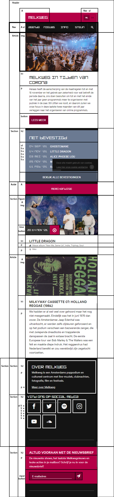
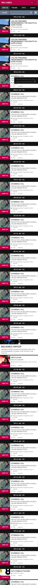

# Procesverslag
**Auteur:** Mike

Markdown cheat cheet: [Hulp bij het schrijven van Markdown](https://github.com/adam-p/markdown-here/wiki/Markdown-Cheatsheet). Nb. de standaardstructuur en de spartaanse opmaak zijn helemaal prima. Het gaat om de inhoud van je procesverslag. Besteedt de tijd voor pracht en praal aan je website.

## Oefeningen
1. [Oefening 1 en 2 van typografie](https://codepen.io/fr3akybeakylike/pen/JjKegmY)
2. [Oefening 1 van positionering](https://codepen.io/fr3akybeakylike/pen/zYBVbPV)
3. [Oefening 2 van positionering](https://codepen.io/fr3akybeakylike/pen/JjKQVGb)
4. [Oefening 1 van flexbox](https://codepen.io/fr3akybeakylike/pen/bGePyae)
5. [Oefening 2 van flexbox](https://codepen.io/fr3akybeakylike/pen/OJRLGJg)
6. [Oefening 1 van JS 3-stap](https://codepen.io/fr3akybeakylike/pen/KKgwMNg)
7. [Oefening 2 van JS 3-stap](https://codepen.io/fr3akybeakylike/pen/poEvbNN)

## Bronnenlijst
1. -bron 1-
2. -bron 2-
3. -...-

## Eindgesprek (week 7/8)

-dit ging goed & dit was lastig-

**Screenshot(s):**

-screenshot(s) van je eindresultaat-

## Voortgang 3 (week 6)

-same as voortgang 1-

## Voortgang 2 (week 5)

-same as voortgang 1-

## Voortgang 1 (week 3)

### Stand van zaken

-dit ging goed & dit was lastig-

**Screenshot(s):**

-screenshot(s) van hoe ver je bent met korte uitleg-

### Agenda voor meeting

-samen met je groepje opstellen-

| student 1      | student 2          | student 3    | student 4        |
| ---            | ---                | ---          | ---              |
| dit bespreken  | en dit             | en ik dit    | en dan ik dat    |
| an dat ook nog | dit als er tijd is | nog een punt | dit wil ik zeker |
| ...            | ...                | ...          | ...              |

### Verslag van meeting

-Na afloop snel uitkomsten vastleggen-
- Alle teksten tegen de tags aan zetten zoals de h2's en p's.
- JS script onderin zetten.
- List gebruiken in plaats van de table.
- Articles bewerken zodat de H2's bovenaan staan, alles moet op hierarchische volgorde.
- Geen link in een button stoppen.
- Styling van images weghalen.
- Een icoon toevoegen bij de tags in de articles met een :before styling (misschien kan er een unicode toegevoegd worden).
- Figcaption in de search form gebruiken, dit maakt het stylen makkelijker.

## Breakdownschets (week 1)

-uitwerken voor de 1e werkgroep - eind van de eerste week-

**Verbeterpunten**
 * Net bevestigd wordt een table
 * Little dragon wordt een article
 * Over melkweg tot de nieuwsbrief is de footer
 * De nieuwsbrief is een aside
 * Fig caption toevoegen aan de img

## Intake (week 1)
-uitwerken voor de kick-off werkgroep - begin van de eerste week-

**Je startniveau:** Blauw, HTML en CSS lukt mij meestal wel, maar bij Javascript loop ik vast.

**Je focus:** Surface plane

**Je opdracht:** [melkweg.nl](melkweg.nl)

**Screenshot(s) van de eerste pagina (small screen):**

**Screenshot(s) van de tweede pagina (small screen):**

